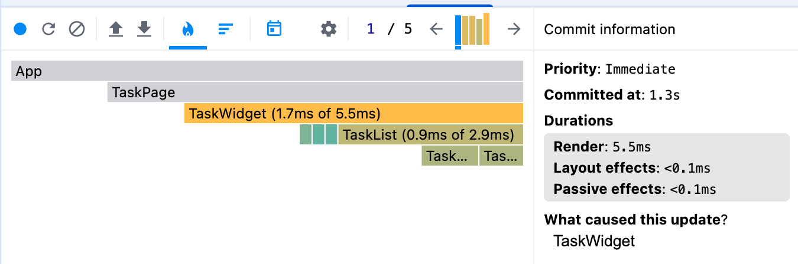
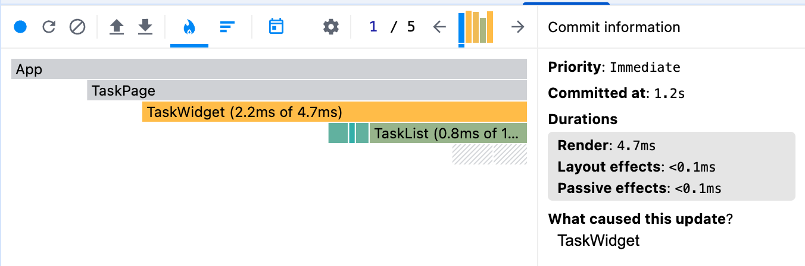

# LESSON-2 — Оптимизация производительности

Ветка: lesson-2

## Запуск

npm ci && npm run dev
npm run build

## Чек-лист

✔️ Оптимизация TaskCard с помощью React.memo — 3 балла
✔️ Мемоизация списка задач с useMemo — 3 балла (было сделано в lesson-1)
✔️ Мемоизация функций с useCallback — 3 балла
✔️ Анализ производительности через DevTools — 3 балла

# Анализ производительности

## До оптимизации

### Наблюдения

- `TaskList` перерисовывается при изменении списка задач
- `TaskCard` также перерисовывается
- Причина — функция `removeTask` создавалась заново при каждом рендере и передавалась в `TaskCard` как новый prop.

---

## После оптимизации

### Что изменилось

- `removeTask` был мемоизирован с помощью `useCallback`
- `TaskCard` перестал выполнять лишние рендеры, если его props не изменились
- Перерисовываются только компоненты, состояние или props которых действительно изменились

---

## Вывод

После мемоизации `removeTask` через `useCallback` и использования `React.memo`удалось избежать лишних рендеров `TaskCard`.

Мемоизация списка отфильтрованных карточек была проведена ранее.
